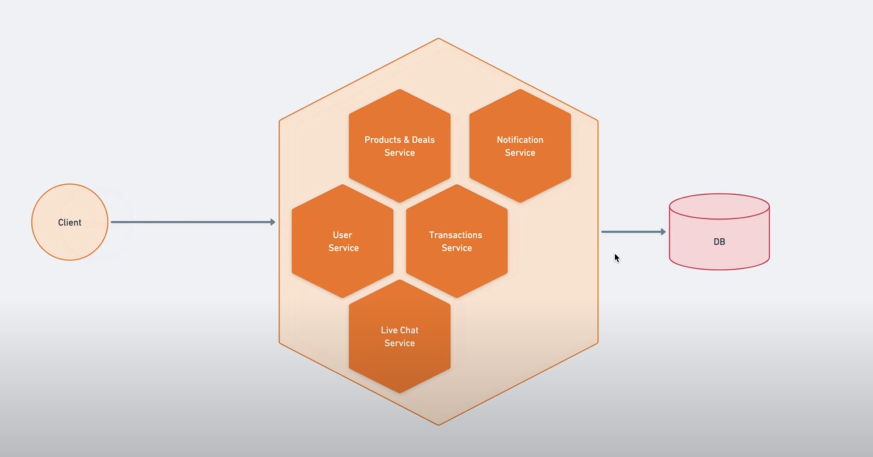

# Application Structure

## Services

- 1. `Product and Deals Service` - This service is responsible for providing the product and deals information to the client. 

- 2. `User Service` - This service is responsible for providing the user information to the client. 

- 3. `Live Chat Service` - This service is responsible for providing the live chat functionality to the client. It is a WebSocket service.

- 4. `Transition Service` - This service is responsible for providing the transition functionality to the client. 

- 5. `Notifications Service` - This service is responsible for providing the notifications functionality to the client. 

