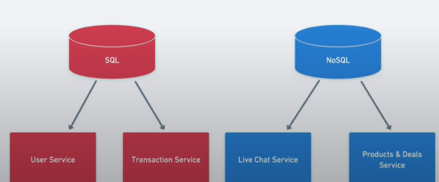

# Database Design

- [Database Expectations](#database-expectations)
  - [User Service](#user-service)
  - [Product Service](#product-service)
  - [Live Chat Service](#live-chat-service)
  - [Transaction Service](#transaction-service)
  - [Notification Service](#notification-service)


## Database Expectations

### User Service

- Create Account (Seller/Buyer)
- Contact Details
- Address
- Payment Methods
- Shopping Cart
- Reviews

### Product Service

- Order
- Transactions
- Shipping

### Live Chat Service

- Live Chat
- Participants

### Transaction Service

- Product Stock
- Categories
- Deals

### Notification Service

- 3rd Party Service (No Database Required)

# Database Design

- SQL & NoSQL
  

## SQL Database

1. User Service
2. Transaction Service

## NoSQL Database

3. Live Chat Service
4. Product & Deals Service

- User Schema

  ```sql
  CREATE TABLE users (
    user_id INT PRIMARY KEY AUTO_INCREMENT,
    phone_number VARCHAR(15) NOT NULL,
    username VARCHAR(50) NOT NULL,
    email VARCHAR(50) NOT NULL,
    password VARCHAR(50) NOT NULL,
    user_type ENUM('buyer', 'seller') NOT NULL,
    created_at TIMESTAMP DEFAULT CURRENT_TIMESTAMP
  );
  ```

- User Address Schema

  ```sql
  CREATE TABLE user_address (
    address_id INT PRIMARY KEY AUTO_INCREMENT,
    user_id INT NOT NULL,
    addressline1 VARCHAR(100) NOT NULL,
    addressline2 VARCHAR(100),
    addressline3 VARCHAR(100),
    city VARCHAR(50) NOT NULL,
    state VARCHAR(50) NOT NULL,
    country VARCHAR(50) NOT NULL,
    zip_code VARCHAR(10) NOT NULL,
    created_at TIMESTAMP DEFAULT CURRENT_TIMESTAMP,
    FOREIGN KEY (user_id) REFERENCES users(user_id)
  );
  ```

- User Payment Schema
  ```sql
  CREATE TABLE user_payment (
    payment_id INT PRIMARY KEY AUTO_INCREMENT,
    user_id INT NOT NULL,
    card_number VARCHAR(20) NOT NULL,
    card_holder_name VARCHAR(50) NOT NULL,
    expiry_date DATE NOT NULL,
    cvv VARCHAR(5) NOT NULL,
    created_at TIMESTAMP DEFAULT CURRENT_TIMESTAMP,
    FOREIGN KEY (user_id) REFERENCES users(user_id)
  );
  ```
- Seller Payment Schema

  ```sql
  CREATE TABLE seller_payment (
    payment_id INT PRIMARY KEY AUTO_INCREMENT,
    seller_id INT NOT NULL,
    account_number VARCHAR(20) NOT NULL,
    account_holder_name VARCHAR(50) NOT NULL,
    bank_name VARCHAR(50) NOT NULL,
    branch_name VARCHAR(50) NOT NULL,
    ifsc_code VARCHAR(20) NOT NULL,
    created_at TIMESTAMP DEFAULT CURRENT_TIMESTAMP,
    FOREIGN KEY (seller_id) REFERENCES users(user_id)
  );
  ```

- Shopping Card Schema

  ```sql
  CREATE TABLE shopping_cart (
    cart_id INT PRIMARY KEY AUTO_INCREMENT,
    user_id INT NOT NULL,
    product_id INT NOT NULL,
    quantity INT NOT NULL,
    created_at TIMESTAMP DEFAULT CURRENT_TIMESTAMP,
    FOREIGN KEY (user_id) REFERENCES users(user_id),
    FOREIGN KEY (product_id) REFERENCES products(product_id)
  );
  ```

- Cart Items Schema
  ```sql
  CREATE TABLE cart_items (
    cart_item_id INT PRIMARY KEY AUTO_INCREMENT,
    cart_id INT NOT NULL,
    product_id INT NOT NULL,
    quantity INT NOT NULL,
    created_at TIMESTAMP DEFAULT CURRENT_TIMESTAMP,
    FOREIGN KEY (cart_id) REFERENCES shopping_cart(cart_id),
    FOREIGN KEY (product_id) REFERENCES products(product_id)
  );
  ```
- Categories Schema
  ```sql
  CREATE TABLE categories (
    category_id INT PRIMARY KEY AUTO_INCREMENT,
    category_name VARCHAR(50) NOT NULL,
    created_at TIMESTAMP DEFAULT CURRENT_TIMESTAMP
  );
  ```
- Product Schema

  ```sql
  CREATE TABLE products (
    product_id INT PRIMARY KEY AUTO_INCREMENT,
    seller_id INT NOT NULL,
    product_name VARCHAR(50) NOT NULL,
    category_id INT NOT NULL,
    description TEXT NOT NULL,
    image_url VARCHAR(255) NOT NULL,
    availibility ENUM('in-stock', 'out-of-stock') NOT NULL,
    stock_unit INT NOT NULL,
    price DECIMAL(10, 2) NOT NULL,
    created_at TIMESTAMP DEFAULT CURRENT_TIMESTAMP,
    dealer_id INT NOT NULL,
    FOREIGN KEY (seller_id) REFERENCES users(user_id),
    FOREIGN KEY (category_id) REFERENCES categories(category_id)
  );
  ```

- Deal Schema

  ```sql
  CREATE TABLE deals (
    deal_id INT PRIMARY KEY AUTO_INCREMENT,
    product_id INT NOT NULL,
    discount DECIMAL(10, 2) NOT NULL,
    active_from DATE NOT NULL,
    active_to DATE NOT NULL,
    created_at TIMESTAMP DEFAULT CURRENT_TIMESTAMP,
    FOREIGN KEY (product_id) REFERENCES products(product_id)
  );
  ```

- Order Schema

  ```sql
  CREATE TABLE orders (
    order_id INT PRIMARY KEY AUTO_INCREMENT,
    user_id INT NOT NULL,
    product_id INT NOT NULL,
    quantity INT NOT NULL,
    total_amount DECIMAL(10, 2) NOT NULL,
    status ENUM('placed', 'shipped', 'delivered') NOT NULL,
    created_at TIMESTAMP DEFAULT CURRENT_TIMESTAMP,
    FOREIGN KEY (user_id) REFERENCES users(user_id),
    FOREIGN KEY (product_id) REFERENCES products(product_id)
    FOREIGN KEY (shopping_card_id) REFERENCES shopping_cart(cart_id)
  );
  ```

- Transaction Schema

  ```sql
  CREATE TABLE transactions (
    transaction_id INT PRIMARY KEY AUTO_INCREMENT,
    order_id INT NOT NULL,
    user_id INT NOT NULL,
    payment_method ENUM('card', 'net-banking', 'wallet','UPI') NOT NULL,
    payment_id INT NOT NULL,
    amount DECIMAL(10, 2) NOT NULL,
    status ENUM('success', 'failed') NOT NULL,
    payment_log TEXT NOT NULL,
    created_at TIMESTAMP DEFAULT CURRENT_TIMESTAMP,
    FOREIGN KEY (order_id) REFERENCES orders(order_id),
    FOREIGN KEY (payment_id) REFERENCES user_payment(payment_id)
  );
  ```

- Shipping Schema

  ```sql
  CREATE TABLE shipping (
    shipping_id INT PRIMARY KEY AUTO_INCREMENT,
    order_id INT NOT NULL,
    user_id INT NOT NULL,
    shipping_address_id INT NOT NULL,
    status ENUM('shipped', 'delivered') NOT NULL,
    created_at TIMESTAMP DEFAULT CURRENT_TIMESTAMP,
    FOREIGN KEY (order_id) REFERENCES orders(order_id),
    FOREIGN KEY (customer_id) REFERENCES users(user_id),
    FOREIGN KEY (shipping_address_id) REFERENCES user_address(address_id)
  );
  ```

- Participant Schema

  ```sql
  CREATE TABLE participants (
    participant_id INT PRIMARY KEY AUTO_INCREMENT,
    user_id INT NOT NULL,
    session_id INT NOT NULL,
    joined_at TIMESTAMP DEFAULT CURRENT_TIMESTAMP,
    FOREIGN KEY (user_id) REFERENCES users(user_id),
    FOREIGN KEY (chat_id) REFERENCES live_chat(chat_id)
  );
  ```

- Live Chat Schema

  ```sql
  CREATE TABLE live_chat (
    chat_id INT PRIMARY KEY AUTO_INCREMENT,
    user_id INT NOT NULL,
    participant_id INT NOT NULL,
    max_user INT NOT NULL,
    user_count INT NOT NULL,
    created_at TIMESTAMP DEFAULT CURRENT_TIMESTAMP,
    FOREIGN KEY (user_id) REFERENCES users(user_id),
    FOREIGN KEY (participant_id) REFERENCES users(user_id)
  );
  ```
