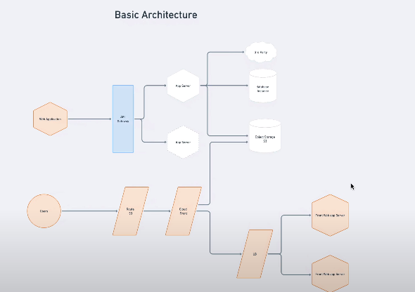
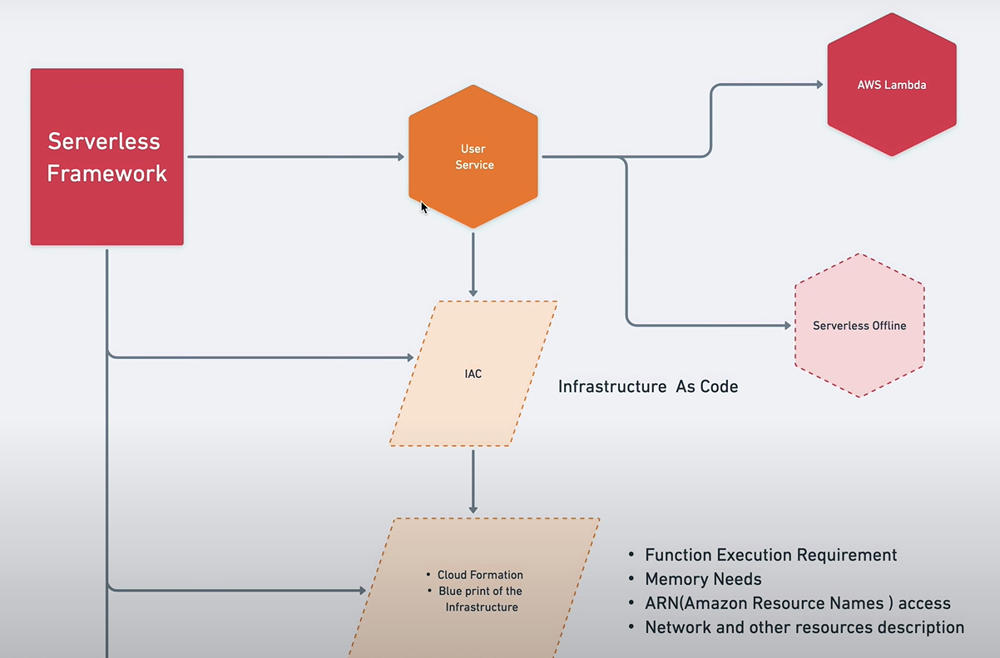

# System Design

1. Functional Requirements
2. Non-Functional Requirements
3. Data Storage Requirements

## 1 . Functional Requirements

1. User Signup and Login
2. User verification through OTP
3. User can become both seller and buyer
4. Seller can Create, Update, Delete, View products
5. Buyer can view products, add to cart, buy products using online payment (Card Online Banking, UPI, Wallet)
6. Seller can receive money after the product is delivered to the buyer
7. Email/Message notification for every process
8. Online chat of buyer and seller
9. Seller can advertise the product

## 2. Non-Functional Requirements

1. High Availability in cloud with multiple regions because of C2C business
2. High Scalability because of the high traffic (Horizontal Scalability)
3. System should design in such a way that can be broke down to microservices
4. Loosly coupled system, services and communications.
5. Machanism for logging and monitoring to inspect sercices and system health and availability
6. System should design with documentation for better scope of understanding the architecture and business logic of the API usages.
7. Should follow CQRS

## 3. Data Storage Requirements

1. Distributed Database for high availability and scalability
2. Should be consistent or eventual consistent.
3. Follow CAP theorem
4. High Availability of Object Storage for multiple regions.

## Basic Architecture

