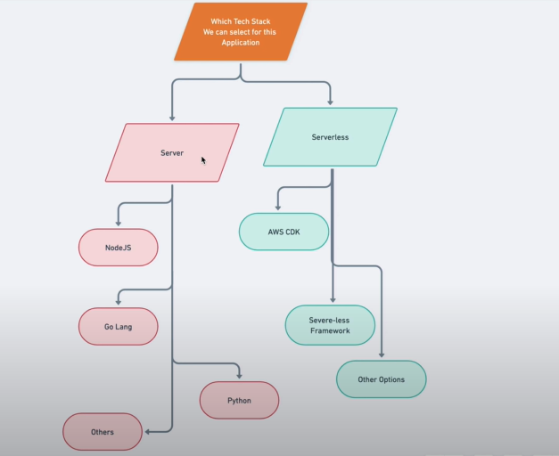

# Tech Stack

- [Frontend](#frontend)
- [Backend](#backend)
- [Database](#database)
- [Server](#server)

## Server

Serverless Architecture

- AWS Lambda
- AWS API Gateway
- AWS S3
- AWS CloudFront
- AWS DynamoDB

## Frontend

- React
- Redux
- UI Library

## Backend

- Node.js
- Express.js

## Database

- SQL (MySQL/ PostgreSQL)
- NoSQL (MongoDB/ DynamoDB)
